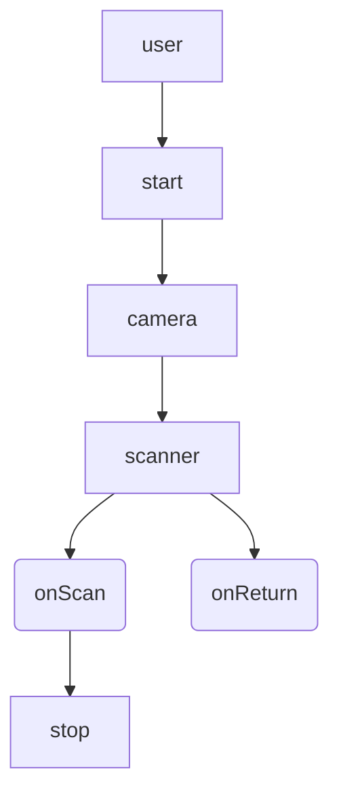
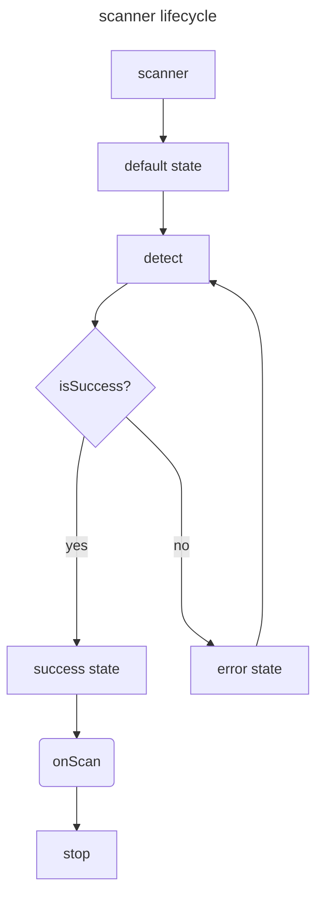

# Flow

```mermaid
flowchart TB

user --> start
start --> camera
camera --> scanner
scanner --> onScan(onScan)
onScan --> stop
scanner --> onReturn(onReturn)
```

---

```mermaid
---
title: scanner lifecycle
---
flowchart TB

scanner --> dState[default state]
dState --> detect
detect --> success{isSuccess?}
success -----> |yes| sState[success state]
sState --> onScan(onScan)
onScan --> stop
success -----> |no| eState[error state]
eState --> detect
```

---

[Documentations](../index.md)
